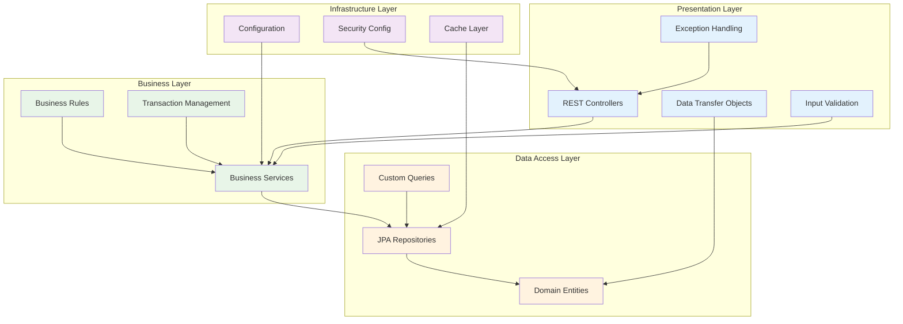
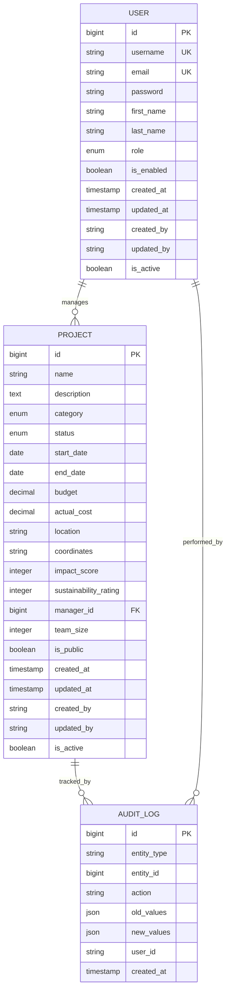
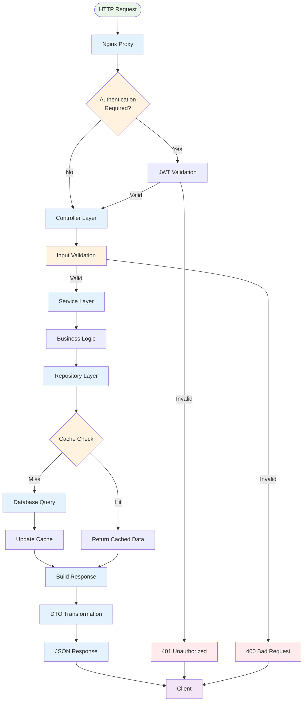
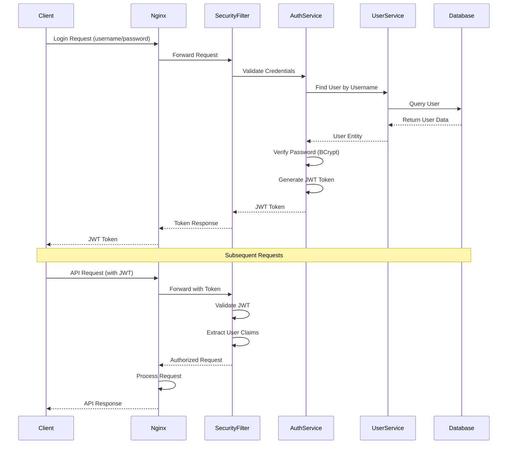

# Application Architecture Diagrams

## Layered Architecture Detail

```mermaid
graph TB
    subgraph "Presentation Layer"
        CONTROLLERS[REST Controllers]
        DTO[Data Transfer Objects]
        VALIDATION[Input Validation]
        EXCEPTION[Exception Handling]
    end
    
    subgraph "Business Layer"
        SERVICES[Business Services]
        BUSINESS_LOGIC[Business Rules]
        TRANSACTIONS[Transaction Management]
    end
    
    subgraph "Data Access Layer"
        REPOSITORIES[JPA Repositories]
        ENTITIES[Domain Entities]
        QUERIES[Custom Queries]
    end
    
    subgraph "Infrastructure Layer"
        CONFIG[Configuration]
        SECURITY[Security Config]
        CACHE[Cache Layer]
    end
    
    CONTROLLERS --> SERVICES
    DTO --> ENTITIES
    VALIDATION --> SERVICES
    EXCEPTION --> CONTROLLERS
    
    SERVICES --> REPOSITORIES
    BUSINESS_LOGIC --> SERVICES
    TRANSACTIONS --> SERVICES
    
    REPOSITORIES --> ENTITIES
    QUERIES --> REPOSITORIES
    
    CONFIG --> SERVICES
    SECURITY --> CONTROLLERS
    CACHE --> REPOSITORIES
    
    classDef presentation fill:#e3f2fd
    classDef business fill:#e8f5e8
    classDef data fill:#fff3e0
    classDef infra fill:#f3e5f5
    
    class CONTROLLERS,DTO,VALIDATION,EXCEPTION presentation
    class SERVICES,BUSINESS_LOGIC,TRANSACTIONS business
    class REPOSITORIES,ENTITIES,QUERIES data
    class CONFIG,SECURITY,CACHE infra
```

## Domain Model Relationships

```mermaid
erDiagram
    USER {
        bigint id PK
        string username UK
        string email UK
        string password
        string first_name
        string last_name
        enum role
        boolean is_enabled
        timestamp created_at
        timestamp updated_at
        string created_by
        string updated_by
        boolean is_active
    }
    
    PROJECT {
        bigint id PK
        string name
        text description
        enum category
        enum status
        date start_date
        date end_date
        decimal budget
        decimal actual_cost
        string location
        string coordinates
        integer impact_score
        integer sustainability_rating
        bigint manager_id FK
        integer team_size
        boolean is_public
        timestamp created_at
        timestamp updated_at
        string created_by
        string updated_by
        boolean is_active
    }
    
    AUDIT_LOG {
        bigint id PK
        string entity_type
        bigint entity_id
        string action
        json old_values
        json new_values
        string user_id
        timestamp created_at
    }
    
    USER ||--o{ PROJECT : manages
    PROJECT ||--o{ AUDIT_LOG : tracked_by
    USER ||--o{ AUDIT_LOG : performed_by
```

## Request Processing Flow

```mermaid
flowchart TD
    START([HTTP Request]) --> NGINX[Nginx Proxy]
    NGINX --> SECURITY{Authentication<br/>Required?}
    
    SECURITY -->|Yes| JWT[JWT Validation]
    SECURITY -->|No| CONTROLLER[Controller Layer]
    
    JWT -->|Valid| CONTROLLER
    JWT -->|Invalid| UNAUTHORIZED[401 Unauthorized]
    
    CONTROLLER --> VALIDATE[Input Validation]
    VALIDATE -->|Valid| SERVICE[Service Layer]
    VALIDATE -->|Invalid| BAD_REQUEST[400 Bad Request]
    
    SERVICE --> BUSINESS[Business Logic]
    BUSINESS --> REPOSITORY[Repository Layer]
    
    REPOSITORY --> CACHE{Cache Check}
    CACHE -->|Hit| CACHE_DATA[Return Cached Data]
    CACHE -->|Miss| DATABASE[Database Query]
    
    DATABASE --> UPDATE_CACHE[Update Cache]
    UPDATE_CACHE --> RESPONSE[Build Response]
    CACHE_DATA --> RESPONSE
    
    RESPONSE --> DTO[DTO Transformation]
    DTO --> JSON[JSON Response]
    JSON --> CLIENT[Client]
    
    UNAUTHORIZED --> CLIENT
    BAD_REQUEST --> CLIENT
    
    classDef start fill:#e8f5e8
    classDef process fill:#e3f2fd
    classDef decision fill:#fff3e0
    classDef error fill:#ffebee
    classDef endpoint fill:#f3e5f5
    
    class START start
    class NGINX,CONTROLLER,SERVICE,REPOSITORY,DATABASE,RESPONSE,DTO,JSON process
    class SECURITY,VALIDATE,CACHE decision
    class UNAUTHORIZED,BAD_REQUEST error
    class CLIENT endpoint
```

## Security Architecture Flow

```mermaid
sequenceDiagram
    participant Client
    participant Nginx
    participant SecurityFilter
    participant AuthService
    participant UserService
    participant Database
    
    Client->>Nginx: Login Request (username/password)
    Nginx->>SecurityFilter: Forward Request
    SecurityFilter->>AuthService: Validate Credentials
    AuthService->>UserService: Find User by Username
    UserService->>Database: Query User
    Database-->>UserService: Return User Data
    UserService-->>AuthService: User Entity
    AuthService->>AuthService: Verify Password (BCrypt)
    AuthService->>AuthService: Generate JWT Token
    AuthService-->>SecurityFilter: JWT Token
    SecurityFilter-->>Nginx: Token Response
    Nginx-->>Client: JWT Token
    
    Note over Client,Database: Subsequent Requests
    
    Client->>Nginx: API Request (with JWT)
    Nginx->>SecurityFilter: Forward with Token
    SecurityFilter->>SecurityFilter: Validate JWT
    SecurityFilter->>SecurityFilter: Extract User Claims
    SecurityFilter-->>Nginx: Authorized Request
    Nginx->>Nginx: Process Request
    Nginx-->>Client: API Response
```
